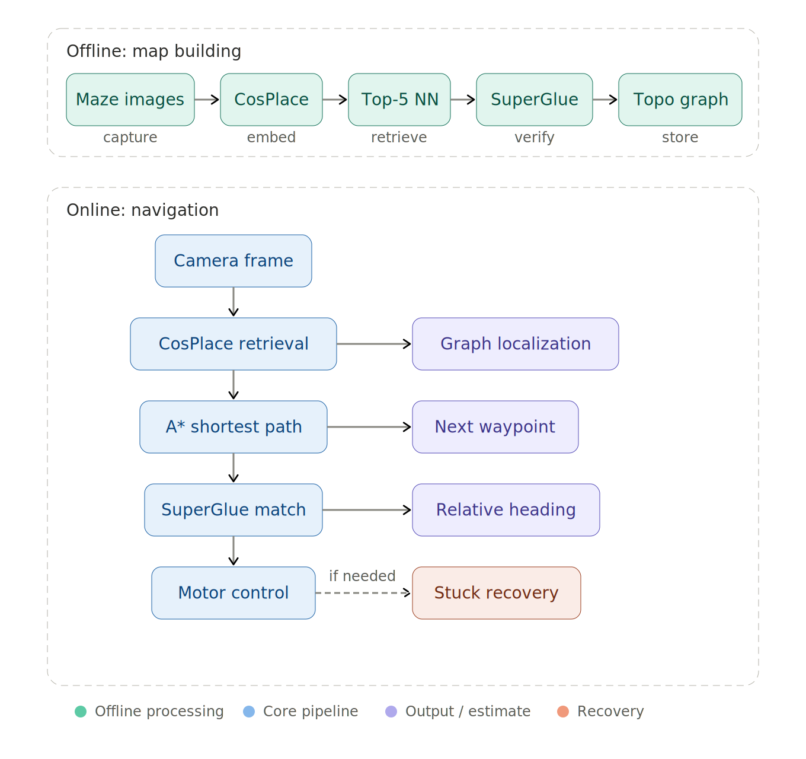

# Voyager — Visual Maze Navigation


Navigate a robot through a maze using only camera images — no map, GPS, or odometry required.

Built for the Robot Vision course (ROB-GY 6203) at NYU. The system constructs a topological graph from explored images offline, then navigates in real-time by matching the robot's live camera feed against the graph using learned visual features.

## Demo


https://github.com/user-attachments/assets/c6fbba8e-42fb-4270-b5b9-73dc540db5ba


https://github.com/user-attachments/assets/b0944968-800c-4be5-b0e6-8bc9ab2a3ff7


## Pipeline



## How It Works

**Phase 1 — Graph Building (Offline)**

1. Extract 512-D global descriptors from exploration images using CosPlace (ResNet backbone)
2. Build a BallTree index for fast nearest-neighbor retrieval (~1-2ms per query)
3. For each image, query top-5 neighbors by CosPlace distance
4. Verify edges with SuperPoint keypoint detection + SuperGlue feature matching
5. Accept edges only when BOTH appearance similarity (distance < 0.25) AND geometric consistency (≥80 RANSAC inliers) are satisfied
6. Detect loop closures via temporal (≥50 frame gap) and spatial (≤5 hop proximity) checks

**Phase 2 — Navigation (Online)**

1. Localize: Match live FPV frame against graph using CosPlace retrieval + SuperGlue verification
2. Plan: Run A* shortest path from current node to goal
3. Execute: Move toward next waypoint, re-localize and re-plan every frame
4. Recover: Stuck detection (>10 frames same location) triggers alternating random turns; search mode rotates up to 6 times to find target
## Project Structure

```
├── autonomous_navigator.py   # Main navigation pipeline (CosPlace + SuperGlue + A*)
├── baseline.py               # Enhanced baseline with graph construction
├── baseline_lv1.py           # Level 1 baseline implementation
├── player.py                 # Game interface and keyboard controls
├── environment.yaml          # Conda environment
└── requirements.txt          # Python dependencies
```

## Setup

```bash
conda env create -f environment.yaml
conda activate game
```

## Run

```bash
# Keyboard exploration
python player.py

# Autonomous navigation
python autonomous_navigator.py
```

## Key Design Decisions

- **Dual verification threshold** — Single criteria (appearance OR geometry alone) failed frequently. Requiring both eliminates false matches from similar-looking corridors and accidental geometric alignment.
- **Learned descriptors over hand-crafted** — CosPlace outperformed SIFT+VLAD in both discrimination and speed (1-2ms vs 50-100ms per query).
- **Waypoint locking** — 5-hop threshold prevents oscillation between nearby graph nodes during navigation.
- **Graph topology tuning** — `knn_max_dist=0.30` and `geo_edge_min_inliers=80` balanced connectivity vs. false edges.

## Results

- Successfully navigated to multiple target locations in the maze
- Loop closure detection identified shortcuts during navigation
- Stuck recovery reliably escaped dead ends with alternating turn strategy
- Graph-based A* planning outperformed sequential exploration

## Stack

`Python` · `PyTorch` · `CosPlace` · `SuperPoint + SuperGlue` · `OpenCV` · `NetworkX` · `scikit-learn (BallTree)` · `NumPy` · `pygame`

## Team

Tarunkumar Palanivelan · Vivekananda Swamy Mattam · Nishanth Pushparaju · Leo Kong
